# How to start react app

1. Go to the **frontend** folder from terminal
2. Run `"yarn install"` to install project dependencies
3. Run `"yarn start"` - This will load the react app at localhost:3000

# Appplication Screenshots

1. **Home Page**

   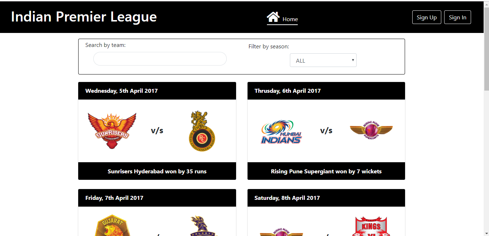

   - Mobile view

   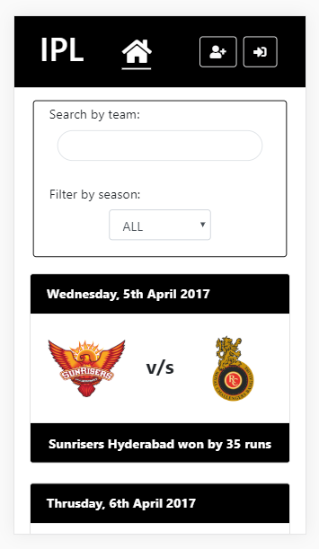

2. **signup Page**

   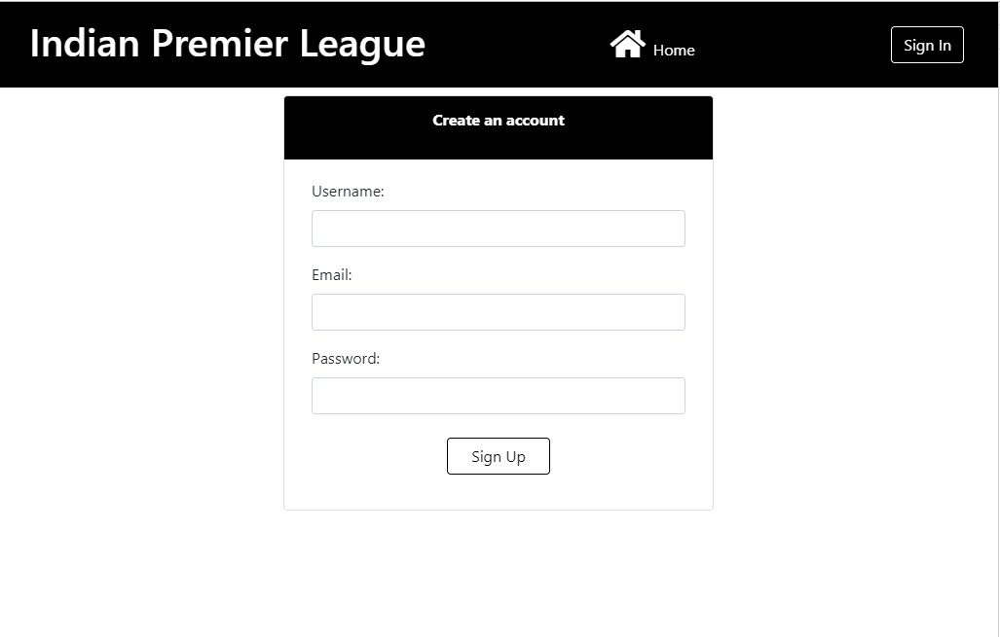

   - Form validation errors

   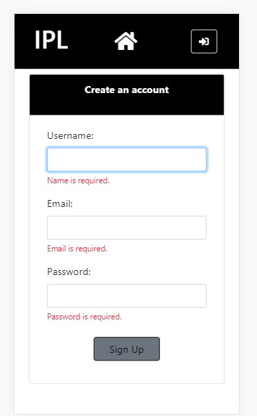

3. **Match Details Page**

   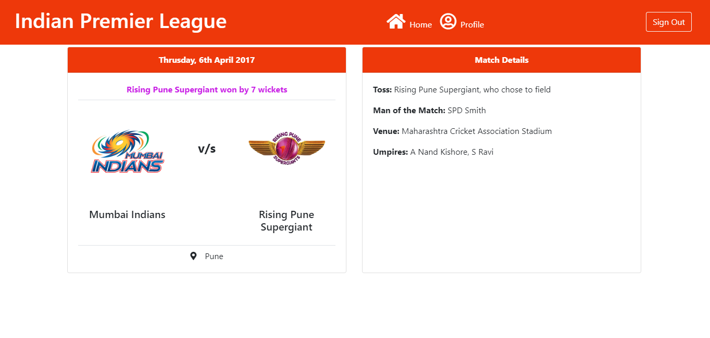

4. **User Profile page**

   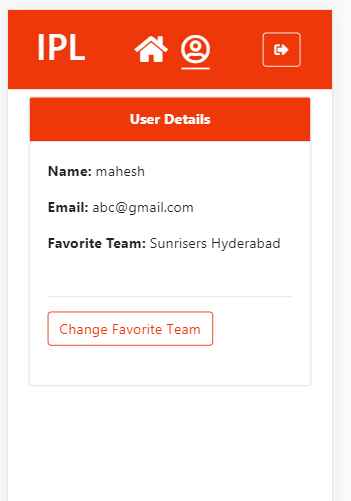

5. **Change in color theme with user's favorite team**

   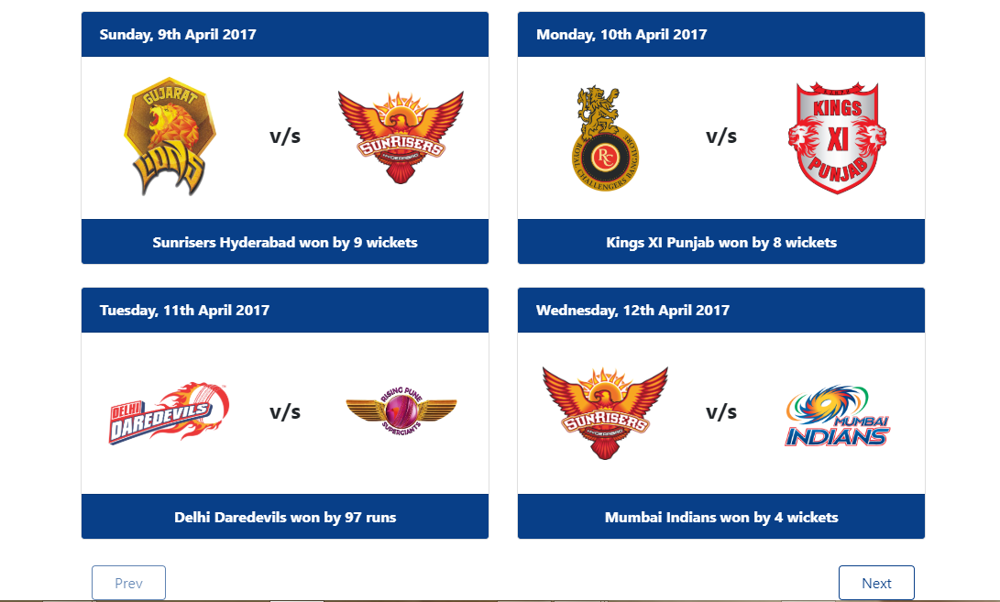
   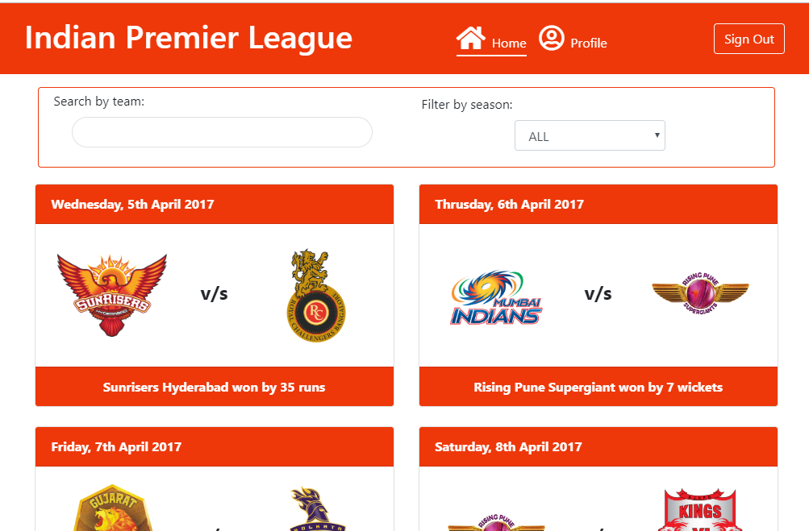
   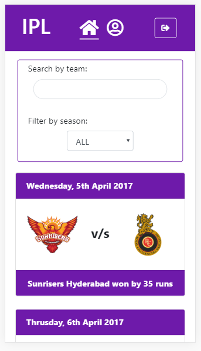
   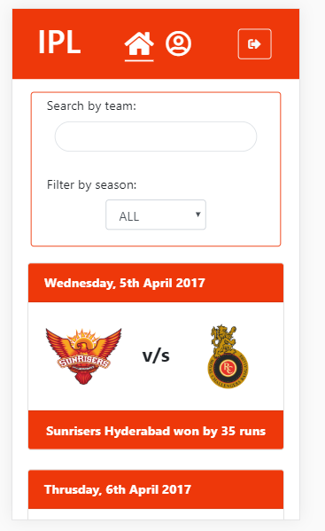
   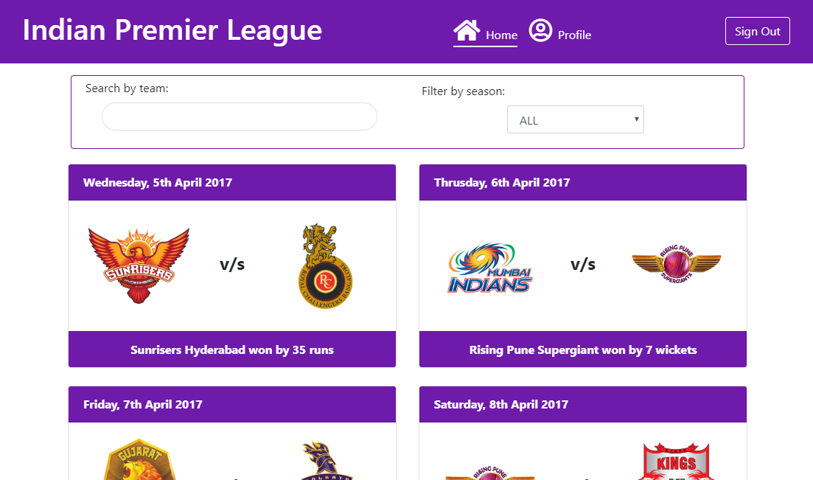
   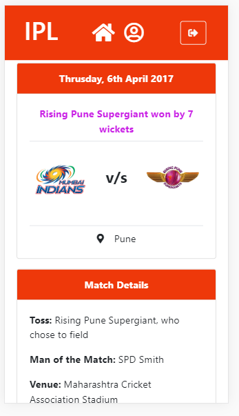
